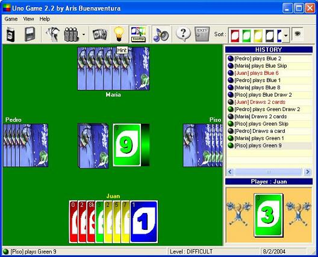



## Uno Game 2\.2 \(Updated: 11/10/04\)

### Description

here's the updated version of my uno game 2.1. More features added, bugs fixed and nice GUI.

BTW, since this is just an update, it's up to you if you want to vote it or not.
 
### More Info
 

             |
---                |---
**Submitted On**   |2004-11-11 15:43:28
**By**             |[Aries Buenaventura](https://github.com/Planet-Source-Code/PSCIndex/blob/master/ByAuthor/aries-buenaventura.md)
**Level**          |Advanced
**User Rating**    |4.9 (165 globes from 34 users)
**Compatibility**  |VB 6\.0
**Category**       |[Games](https://github.com/Planet-Source-Code/PSCIndex/blob/master/ByCategory/games__1-38.md)
**World**          |[Visual Basic](https://github.com/Planet-Source-Code/PSCIndex/blob/master/ByWorld/visual-basic.md)
**Archive File**   |[Uno\_Game\_218310812192004\.zip](https://github.com/Planet-Source-Code/aries-buenaventura-uno-game-2-2-updated-11-10-04__1-57184/archive/master.zip)

